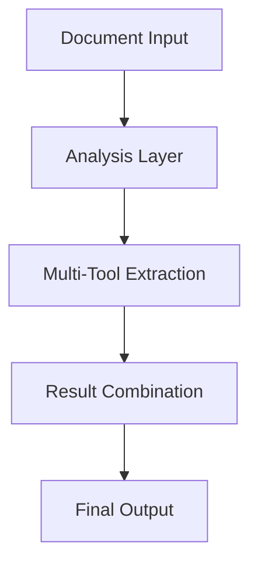

# Processing Approach Evolution

## Initial Testing Results

### 1. Metadata-Only Approach
- **Implementation**: Used in early PDF processor versions
- **Results**: Very clean, factual responses
- **Strengths**: Perfect for formal reports and data extraction
- **Limitations**: Lost human context and narrative flow

### 2. Source-Only Approach
- **Implementation**: Used in OFW message processing
- **Results**: Rich context but noisy output
- **Strengths**: Good for narrative understanding
- **Limitations**: Sometimes included irrelevant information

### 3. Combined Approach (Winner)
- **Implementation**: Current enhanced pipeline
- **Results**: Best balance of structure and context
- **Strengths**: Maintains both facts and human elements
- **Limitations**: More complex to implement

## Evolution into Current Pipeline

### Document Analysis Layer
```javascript
// Combines metadata and content analysis
class DocumentAnalyzer {
  analyzeDocument(file) {
    const metadata = extractMetadata(file);  // Clean facts
    const content = extractContent(file);    // Rich context
    return combineAnalysis(metadata, content);
  }
}
```

### Multi-Tool Integration
```javascript
// Each tool provides different perspective
const extractionTools = {
  adobe: {
    focus: "Structure and OCR",
    bestFor: "Scanned documents"
  },
  fitz: {
    focus: "Fast text and layout",
    bestFor: "Digital documents"
  },
  pdfminer: {
    focus: "Detailed analysis",
    bestFor: "Complex documents"
  },
  tika: {
    focus: "Fallback and metadata",
    bestFor: "Backup extraction"
  }
};
```

### Result Combination
```javascript
// Balances structure and context
class ResultCombiner {
  combineResults(results) {
    return {
      // Structural elements (from metadata)
      structure: extractStructure(results),
      
      // Contextual elements (from content)
      context: preserveContext(results),
      
      // Combined insights
      insights: generateInsights(results)
    };
  }
}
```

## Lessons Learned

### 1. Processing Strategy
- **Metadata**: Essential for structure and facts
- **Source Content**: Crucial for context and relationships
- **Combined Processing**: Provides complete understanding

### 2. Tool Selection
- Multiple tools provide different perspectives
- Each tool has specific strengths
- Combination provides robust results

### 3. Result Integration
- Cross-validation improves accuracy
- Context preservation is critical
- Balance between structure and narrative

## Current Implementation

### Processing Pipeline


### Quality Metrics
```javascript
const qualityMetrics = {
  structure: {
    accuracy: "Very High",     // From metadata
    completeness: "High",      // From multiple tools
    reliability: "Excellent"   // From validation
  },
  context: {
    preservation: "High",      // From source
    relevance: "Excellent",    // From combination
    usefulness: "Very High"    // From integration
  }
};
```

### Success Factors
```javascript
const successFactors = {
  accuracy: {
    metadata: "Clean, factual data",
    content: "Rich context",
    combined: "Complete picture"
  },
  usability: {
    metadata: "Easy to process",
    content: "Human-readable",
    combined: "Best of both"
  },
  reliability: {
    metadata: "Consistent",
    content: "Comprehensive",
    combined: "Robust"
  }
};
```

## Future Directions

### 1. Enhanced Integration
- Deeper tool integration
- Smarter result combination
- Better context preservation

### 2. Improved Analysis
- Advanced pattern detection
- Better relationship mapping
- Enhanced context understanding

### 3. Quality Improvements
- More robust validation
- Better error handling
- Enhanced monitoring

## Best Practices

### 1. Processing Approach
- Start with metadata for structure
- Add content for context
- Combine results carefully

### 2. Tool Usage
- Use appropriate tools for each task
- Combine results intelligently
- Maintain quality checks

### 3. Result Management
- Preserve important context
- Maintain clean structure
- Balance detail and clarity
