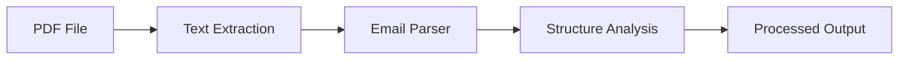

# Email Parser Analysis

## Current Implementation
We're currently using a basic PDF extraction approach with:
- pdf-parse for text extraction
- Basic regex patterns for email structure detection
- Manual header/metadata parsing

## Available NPM Packages

### 1. emailjs-mime-parser
```json
{
  "name": "emailjs-mime-parser",
  "features": [
    "MIME message parsing",
    "Header extraction",
    "Attachment handling",
    "Encoding support"
  ],
  "pros": [
    "Complete MIME parsing",
    "Well-maintained",
    "Good documentation",
    "Handles complex email structures"
  ],
  "cons": [
    "Requires raw email format",
    "Would need PDF-to-MIME conversion"
  ]
}
```

### 2. mailparser
```json
{
  "name": "mailparser",
  "features": [
    "Stream-based parsing",
    "Attachment extraction",
    "HTML/text content parsing",
    "Address parsing"
  ],
  "pros": [
    "Streaming support for large files",
    "Built-in attachment handling",
    "Comprehensive email parsing"
  ],
  "cons": [
    "Primarily for .eml files",
    "Would need format conversion"
  ]
}
```

### 3. email-parser
```json
{
  "name": "email-parser",
  "features": [
    "Simple text parsing",
    "Header extraction",
    "Basic structure analysis"
  ],
  "pros": [
    "Lightweight",
    "Easy integration",
    "Works with text input"
  ],
  "cons": [
    "Limited features",
    "Less maintained"
  ]
}
```

## Potential MCP Implementations

### 1. Email Processing MCP
```typescript
interface EmailProcessorMCP {
  tools: {
    parseEmail: {
      input: {
        content: string;
        format: "pdf" | "text" | "eml";
        options?: {
          extractAttachments?: boolean;
          parseHeaders?: boolean;
          includeMetadata?: boolean;
        };
      };
      output: {
        headers: Record<string, string>;
        body: string;
        attachments?: Array<{
          filename: string;
          content: Buffer;
          contentType: string;
        }>;
        metadata?: {
          sender: string;
          recipients: string[];
          date: string;
          subject: string;
        };
      };
    };
  };
  resources: {
    "email://[format]/[id]": {
      format: string;
      content: string;
      parsed: boolean;
    };
  };
}
```

### 2. Email Analysis MCP
```typescript
interface EmailAnalysisMCP {
  tools: {
    analyzeThread: {
      input: {
        emails: string[];
        options: {
          threadDetection?: boolean;
          participantAnalysis?: boolean;
          timelineGeneration?: boolean;
        };
      };
      output: {
        thread: {
          participants: string[];
          timeline: Array<{
            timestamp: string;
            sender: string;
            action: string;
          }>;
          relationships: Record<string, string[]>;
        };
      };
    };
  };
}
```

## Integration Options

### 1. Enhanced Current Pipeline


### 2. MCP-Based Pipeline


## Recommendations

### Short-term Improvements
1. Integrate emailjs-mime-parser
   - Better email structure handling
   - Improved metadata extraction
   - More reliable parsing

2. Create Email Processing MCP
   - Centralize email processing logic
   - Support multiple formats
   - Standardize output format

### Long-term Strategy
1. Build comprehensive Email Analysis MCP
   - Thread detection
   - Participant analysis
   - Timeline generation

2. Enhance pipeline with:
   - Streaming support for large files
   - Parallel processing
   - Better error handling

## Implementation Plan

### Phase 1: Enhanced Parser
1. Add emailjs-mime-parser
2. Create PDF-to-MIME converter
3. Implement streaming support

### Phase 2: MCP Development
1. Create Email Processing MCP
2. Add format converters
3. Implement analysis tools

### Phase 3: Pipeline Integration
1. Update pipeline to use new tools
2. Add parallel processing
3. Enhance error handling

## Next Steps
1. Test emailjs-mime-parser with sample data
2. Create proof-of-concept MCP
3. Benchmark performance improvements
4. Update documentation

## Dependencies to Add
```json
{
  "dependencies": {
    "emailjs-mime-parser": "^2.0.7",
    "mailparser": "^3.6.5",
    "email-parser": "^1.0.0"
  }
}
```

## Notes
- Consider memory usage for large files
- Need format conversion utilities
- Should support multiple email formats
- Error handling is critical
- Performance optimization needed
