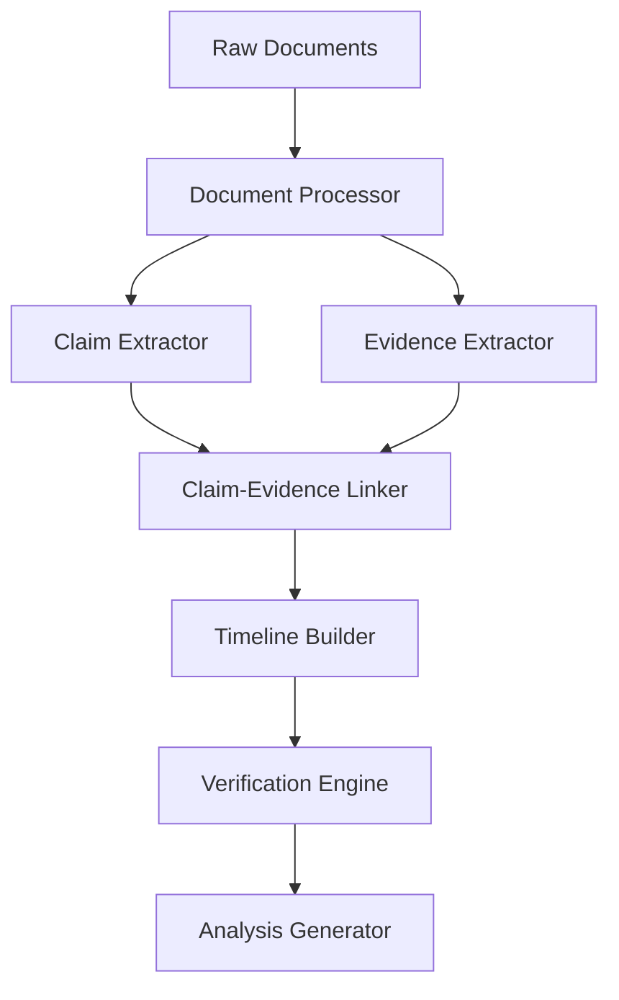

# Evidence-Centric Architecture

## Core Principles

1. **Evidence First**
   - Every claim must be linked to source documentation
   - Attachments are first-class citizens, not metadata
   - Cross-referencing between claims and evidence is mandatory
   - Verification requires multiple source types

2. **Temporal Foundation**
   - Time is the universal join key across all sources
   - Every document, claim, and evidence has a timestamp
   - Events form chains of causality
   - Temporal inconsistencies flag potential issues

3. **Document Relationships**
   ```
   Document
   ├── Source (Email, OFW, Court Record, etc.)
   ├── Timestamp
   ├── Claims[] (assertions made in the document)
   ├── Evidence[] (attachments, references)
   └── Relationships[]
       ├── Temporal (before/after)
       ├── Causal (caused by/led to)
       ├── Supporting (proves/disproves)
       └── Reference (mentions/responds to)
   ```

## Evidence Processing Pipeline



1. **Document Processor**
   - Handles all source types (Email, OFW, Court Records, etc.)
   - Extracts metadata and content
   - Identifies attachments and references
   - Establishes document chronology

2. **Claim Extractor**
   - Identifies assertions and statements
   - Tags claims requiring verification
   - Groups related claims
   - Maintains claim provenance

3. **Evidence Extractor**
   - Processes attachments and supporting documents
   - Extracts verifiable information
   - Categorizes evidence types
   - Links evidence to source documents

4. **Claim-Evidence Linker**
   - Maps claims to supporting evidence
   - Identifies verification gaps
   - Tracks evidence chains
   - Flags contradictions

5. **Timeline Builder**
   - Orders events chronologically
   - Establishes causal relationships
   - Identifies patterns and sequences
   - Maintains temporal integrity

6. **Verification Engine**
   - Cross-references multiple sources
   - Validates claim-evidence links
   - Checks temporal consistency
   - Identifies corroboration/contradiction

7. **Analysis Generator**
   - Produces factual summaries
   - Highlights key patterns
   - Reports verification status
   - Maintains objective stance

## Evidence Schema

```typescript
interface Evidence {
  id: string;
  type: 'attachment' | 'reference' | 'statement';
  source: {
    type: 'email' | 'ofw' | 'court' | 'financial';
    id: string;
    timestamp: string;
  };
  content: {
    raw: string;
    processed: any;
    verification: {
      status: 'verified' | 'unverified' | 'contradicted';
      method: string;
      confidence: number;
    };
  };
  relationships: {
    supports: string[];    // IDs of claims this evidence supports
    contradicts: string[]; // IDs of claims this evidence contradicts
    precedes: string[];    // IDs of evidence that came after
    follows: string[];     // IDs of evidence that came before
  };
  metadata: {
    processingDate: string;
    chain: string[];      // Chain of custody/processing
    hash: string;         // Content hash for integrity
  };
}

interface Claim {
  id: string;
  source: {
    document: string;     // ID of source document
    location: string;     // Location within document
    timestamp: string;
  };
  content: {
    text: string;        // The actual claim
    type: string;        // Type of claim (statement, request, response)
    requires: string[];  // Types of evidence needed for verification
  };
  verification: {
    status: 'verified' | 'unverified' | 'contradicted';
    evidence: {
      supporting: string[];    // IDs of supporting evidence
      contradicting: string[]; // IDs of contradicting evidence
    };
    confidence: number;
  };
  relationships: {
    precedes: string[];  // Claims this one came before
    follows: string[];   // Claims this one came after
    relates: string[];   // Related claims
  };
}

interface Timeline {
  events: Array<{
    timestamp: string;
    type: 'claim' | 'evidence';
    id: string;
    context: {
      preceding: string[];  // IDs of relevant preceding events
      following: string[];  // IDs of relevant following events
      related: string[];   // IDs of related concurrent events
    };
    verification: {
      status: string;
      confidence: number;
      sources: string[];   // Source document IDs
    };
  }>;
  patterns: Array<{
    type: string;          // Type of pattern identified
    events: string[];      // IDs of events in pattern
    confidence: number;
    evidence: string[];    // Evidence supporting pattern
  }>;
}
```

## LLM Integration Strategy

1. **Objective Reporting**
   - Focus on verifiable facts
   - Clear distinction between claims and evidence
   - Explicit source attribution
   - Confidence scoring for all assertions

2. **Pattern Recognition**
   - Identify repeated behaviors
   - Track claim-evidence patterns
   - Temporal clustering
   - Cross-source correlation

3. **Analysis Generation**
   ```typescript
   interface Analysis {
     factual: {
       claims: Array<{
         text: string;
         evidence: string[];
         confidence: number;
       }>;
       patterns: Array<{
         description: string;
         supporting_events: string[];
         confidence: number;
       }>;
     };
     temporal: {
       sequences: Array<{
         description: string;
         events: string[];
         significance: string;
       }>;
     };
     verification: {
       gaps: string[];
       contradictions: string[];
       corroborations: string[];
     };
   }
   ```

## Next Steps

1. **Immediate**
   - Implement Evidence schema
   - Build attachment processing pipeline
   - Create claim-evidence linking system
   - Develop temporal verification engine

2. **Short Term**
   - Enhance cross-source verification
   - Implement pattern recognition
   - Build evidence visualization tools
   - Create verification reporting system

3. **Long Term**
   - Add more document types
   - Enhance pattern recognition
   - Develop predictive analytics
   - Build case law integration

## Key Considerations

1. **Data Integrity**
   - Maintain evidence chain of custody
   - Hash all documents and attachments
   - Version control for all processing
   - Audit trail for all analyses

2. **Verification Levels**
   - Raw claim (unverified statement)
   - Supported claim (has related evidence)
   - Verified claim (evidence confirms)
   - Corroborated claim (multiple sources confirm)

3. **Pattern Types**
   - Temporal (sequence of events)
   - Behavioral (repeated actions)
   - Evidentiary (document relationships)
   - Contextual (surrounding circumstances)

4. **Output Types**
   - Factual timeline
   - Evidence mapping
   - Pattern analysis
   - Verification report
   - Gap analysis
