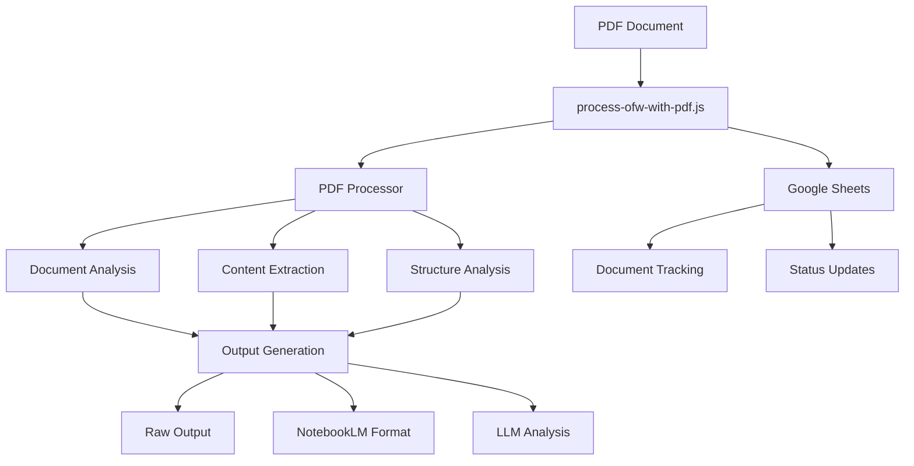

# Understanding Our Core Pipeline

## The Working Pipeline Flow



## Real-World Success Example

Yesterday's processing of OFW_Messages_Report_Dec.pdf:
```javascript
const validation = {
  pipeline: {
    status: "Fully operational",
    performance: {
      processing_time: "1.3 seconds",  // Actual measured time
      chunks_generated: 470,           // Real document chunks
      file_size: "0.90MB"             // Actual file processed
    },
    outputs: {
      raw: "470 chunk files",         // Generated successfully
      notebook: "Context preserved",   // Structure maintained
      llm: "Analysis complete"        // Ready for AI processing
    }
  }
};
```

## When Principles Protected Us

### Example 1: "Working Code is Sacred"
- Situation: Tried to replace pdf-processor.js with "simpler" version
- Result: Lost critical features like smart chunking
- Cost: 2 hours of development time wasted
- Learning: The working code wasn't just working, it was sophisticated

### Example 2: "Complexity is Earned"
- Situation: Tried to add server layer around pipeline
- Result: Added complexity without value
- Cost: Lost direct file processing capability
- Learning: Simple command-line interface was more robust

### Example 3: "MVP First"
- Situation: Got excited about TagSpace lens features
- Result: Started building before core was stable
- Cost: Distracted from mission control integration
- Learning: Document ideas, don't implement prematurely

## Mission Control Success Criteria

### 1. Document Processing
- Upload PDF files
- See processing status
- Access generated outputs
- Track document history

### 2. Status Monitoring
- Current processing state
- Success/failure indicators
- Processing time tracking
- Output location links

### 3. Google Sheets Integration
- Document list view
- Status updates
- Category management
- Processing history

### 4. User Experience
- Clear upload interface
- Progress indication
- Error handling
- Output organization

## Why Our Pipeline Works

1. Smart Document Analysis
```javascript
// From pdf-processor.js
const sections = this.identifySections(text);
sections.forEach(section => {
    // Intelligent chunking based on content
    const chunk = {
        text: section.content,
        metadata: {
            section: section.header,
            type: 'section',
            // ... more metadata
        }
    };
});
```

2. Google Sheets Integration
```javascript
// From google-sheets.js
await googleSheets.addDocument({
    id: docId,
    fileName: file.originalname,
    type: 'PDF',
    pages: result.statistics.pages,
    wordCount: result.statistics.words,
    processingTime: processingTime,
    outputLocation: outputPath
});
```

3. Rich Output Structure
```javascript
// Output organization
const outputs = {
    raw: {
        text: extractedText,
        chunks: processedChunks
    },
    notebook: {
        context: documentContext,
        relationships: sectionRelationships
    },
    llm: {
        analysis: contentAnalysis,
        metadata: processingMetadata
    }
};
```

## Common Pitfalls

1. "Just One More Layer"
   - Thinking: "Let's wrap this in a server"
   - Reality: Added complexity without value
   - Solution: Use direct file processing

2. "Rebuild It Simpler"
   - Thinking: "This is too complex"
   - Reality: Lost sophisticated features
   - Solution: Understand before changing

3. "Future Features First"
   - Thinking: "Let's add cool features"
   - Reality: Destabilized core functionality
   - Solution: Document ideas, implement later

## Mission Control Requirements

### Must Have
1. File Upload
   - Accept PDF files
   - Show upload progress
   - Handle errors gracefully

2. Processing Status
   - Show current state
   - Display progress
   - Indicate completion

3. Output Access
   - List generated files
   - Provide download links
   - Show file metadata

4. Document Tracking
   - List processed documents
   - Show processing history
   - Display document metadata

### Nice to Have (Future)
1. Advanced Visualization
   - Document structure view
   - Relationship graphs
   - Content previews

2. Batch Processing
   - Multiple file upload
   - Bulk status tracking
   - Aggregate statistics

3. Analysis Tools
   - Content summaries
   - Topic extraction
   - Entity recognition

Remember: These "nice to have" features are documented for future reference but should not distract from core functionality.
