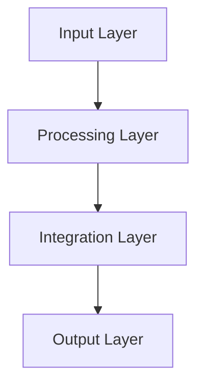

# Key Learnings and Patterns

## Core Patterns We've Discovered

### 1. Balance is Critical
```javascript
const balancePatterns = {
  processing: {
    structure: "Clean metadata",     // Provides organization
    context: "Rich source content",  // Preserves meaning
    balance: "Combined approach"     // Best results
  },
  chunking: {
    size: "150k tokens",            // Optimal chunk size
    overlap: "10% context",         // Maintains flow
    structure: "Natural breaks"     // Preserves meaning
  },
  analysis: {
    depth: "Multiple tools",        // Different perspectives
    integration: "Cross-validation", // Improves accuracy
    quality: "Combined metrics"     // Complete picture
  }
};
```

### 2. Three-Part Pattern
We keep discovering this pattern in different contexts:
```javascript
const threePartPattern = {
  examples: {
    processing: ["Metadata", "Source", "Combined"],
    roles: ["Librarian", "Detective", "Oracle"],
    analysis: ["Structure", "Content", "Integration"]
  },
  characteristics: {
    first: "Clean, structured, limited",
    second: "Rich, detailed, noisy",
    third: "Balanced, complete, optimal"
  }
};
```

### 3. Integration Points
Key integration patterns that work:
```javascript
const integrationPatterns = {
  tools: {
    primary: "Fast, reliable tool",
    secondary: "Detailed analysis tool",
    fallback: "Backup solution"
  },
  data: {
    structure: "Clean organization",
    context: "Rich relationships",
    metadata: "Clear tracking"
  },
  roles: {
    organization: "Librarian pattern",
    analysis: "Detective pattern",
    insight: "Oracle pattern"
  }
};
```

## Successful Approaches

### 1. Document Processing
- Start with structure (metadata)
- Add context (source content)
- Combine intelligently
- Validate results
- Preserve relationships

### 2. Tool Integration
- Use specialized tools
- Combine results
- Cross-validate
- Handle failures gracefully
- Maintain quality

### 3. Role Implementation
- Clear responsibilities
- Focused tools
- Specific outputs
- Quality metrics
- Cross-role collaboration

## Common Challenges and Solutions

### 1. Complexity Management
```javascript
const complexityPatterns = {
  challenge: "Growing system complexity",
  solutions: {
    modular: "Break into components",
    layered: "Clear responsibility layers",
    focused: "Single purpose tools"
  }
};
```

### 2. Quality Control
```javascript
const qualityPatterns = {
  challenge: "Maintaining quality at scale",
  solutions: {
    validation: "Multi-level checks",
    metrics: "Clear quality measures",
    feedback: "Continuous improvement"
  }
};
```

### 3. Integration Issues
```javascript
const integrationPatterns = {
  challenge: "Tool and system integration",
  solutions: {
    standards: "Common interfaces",
    protocols: "Clear communication",
    fallbacks: "Graceful degradation"
  }
};
```

## Repeated Success Patterns

### 1. Three-Layer Architecture


### 2. Quality Metrics
```javascript
const qualityMetrics = {
  accuracy: {
    data: "Clean, correct information",
    structure: "Proper organization",
    relationships: "Valid connections"
  },
  completeness: {
    content: "All required information",
    context: "Necessary background",
    connections: "Related data"
  },
  usability: {
    access: "Easy to find",
    understand: "Clear meaning",
    apply: "Actionable insights"
  }
};
```

### 3. Integration Strategy
```javascript
const integrationStrategy = {
  steps: {
    analyze: "Understand requirements",
    plan: "Design integration",
    implement: "Build connections",
    validate: "Ensure quality",
    monitor: "Track performance"
  },
  patterns: {
    interfaces: "Standard connections",
    protocols: "Clear communication",
    validation: "Quality checks"
  }
};
```

## Future Applications

### 1. Pattern Recognition
- Apply successful patterns to new areas
- Adapt based on context
- Maintain core principles
- Scale effectively
- Monitor results

### 2. Quality Evolution
- Build on successful approaches
- Learn from challenges
- Improve metrics
- Enhance validation
- Expand capabilities

### 3. Integration Growth
- Extend successful patterns
- Add new capabilities
- Maintain standards
- Improve connections
- Scale effectively

## Best Practices

### 1. Development
- Start simple
- Add complexity gradually
- Validate each step
- Maintain quality
- Document thoroughly

### 2. Integration
- Use proven patterns
- Follow standards
- Test thoroughly
- Monitor performance
- Handle errors

### 3. Quality
- Define clear metrics
- Validate continuously
- Monitor actively
- Improve regularly
- Document learning

## Continuous Improvement

### 1. Learning Cycle
```javascript
const learningCycle = {
  steps: {
    observe: "Watch system behavior",
    analyze: "Understand patterns",
    improve: "Make enhancements",
    validate: "Check results"
  },
  focus: {
    patterns: "Successful approaches",
    problems: "Areas to improve",
    opportunities: "Growth areas"
  }
};
```

### 2. Documentation
- Record learnings
- Share knowledge
- Update regularly
- Track changes
- Maintain history

### 3. Evolution
- Build on success
- Learn from failures
- Adapt to needs
- Grow capabilities
- Maintain quality
