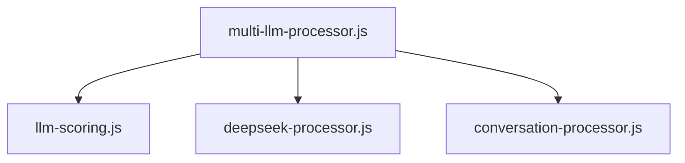
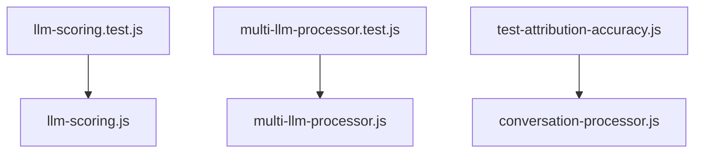

# LLM File Inventory and Analysis

## Total File Count: 24 LLM-Related Files

## Directory Structure

### Source Files (7)
```
src/services/
├── llm-scoring.js
├── multi-llm-processor.js
├── conversation-processor.js
└── models/
    ├── README.md
    └── deepseek-processor.js
```

### Test Files (6)
```
test/
├── unit/
│   ├── llm-scoring.test.js
│   └── multi-llm-processor.test.js
└── test-attribution-accuracy.js
```

### Prompt Files (7)
```
prompts/
├── roles/
│   └── PROMPT_TEMPLATES.md
├── deepseek/
├── gpt4/
├── notebooklm/
├── sonnet/
├── VISUALIZATION_PROMPT.md
└── SAMPLE_DATA.json
```

### Web Components (4)
```
Web/
├── components/
│   └── llm-comparison.html
├── dashboard-with-llm.html
└── mission-control-v2.html
```

## File Purposes

### Core Processing
1. llm-scoring.js
   - Primary scoring and evaluation engine
   - Handles response quality metrics
   - Implements confidence calculations
   - Dependencies: None

2. multi-llm-processor.js
   - Orchestrates multiple LLM models
   - Manages model selection and routing
   - Aggregates responses
   - Dependencies: llm-scoring.js

3. conversation-processor.js
   - Handles conversational context
   - Manages dialogue state
   - Processes multi-turn interactions
   - Dependencies: multi-llm-processor.js

### Model Integration
1. deepseek-processor.js
   - DeepSeek model interface
   - Custom prompt formatting
   - Response parsing
   - Dependencies: multi-llm-processor.js

### Testing
1. llm-scoring.test.js
   - Tests scoring algorithms
   - Validates confidence calculations
   - Covers edge cases
   - Dependencies: llm-scoring.js

2. multi-llm-processor.test.js
   - Tests model orchestration
   - Validates response aggregation
   - Tests error handling
   - Dependencies: multi-llm-processor.js

3. test-attribution-accuracy.js
   - Tests source attribution
   - Validates reference tracking
   - Dependencies: conversation-processor.js

### Prompts and Templates
1. PROMPT_TEMPLATES.md
   ```markdown
   # Role-specific templates
   - Analysis roles
   - Technical roles
   - Research roles
   - Creative roles
   ```

2. Model-specific directories
   - Each contains optimized prompts
   - Includes examples and constraints
   - Contains performance notes

### Web Interface
1. llm-comparison.html
   - Displays model comparisons
   - Shows confidence scores
   - Visualizes performance metrics

2. dashboard-with-llm.html
   - LLM integration dashboard
   - Real-time processing status
   - Performance monitoring

## File Relationships

### Processing Chain


### Testing Coverage


## LLM-Specific Optimizations

### DeepSeek
- Technical content focus
- Code analysis capabilities
- Structured output format

### GPT-4
- Complex reasoning tasks
- Multi-step analysis
- Natural language understanding

### NotebookLM
- Research integration
- Citation handling
- Academic format

### Sonnet
- Creative tasks
- Natural language generation
- Style adaptation

## Package Preparation Guidelines

### 1. File Organization
- Group by functionality
- Maintain clear dependencies
- Include all required prompts

### 2. Model-Specific Requirements
- Separate prompt templates
- Custom formatting rules
- Performance benchmarks

### 3. Documentation
- File relationships
- Dependencies
- Configuration requirements
- Usage examples

### 4. Testing
- Unit tests
- Integration tests
- Performance tests
- Edge cases

## Best Practices for LLM Upload

### 1. File Preparation
- Clean and validate all files
- Remove development artifacts
- Include only necessary dependencies
- Verify file permissions

### 2. Documentation Requirements
- Complete API documentation
- Usage examples
- Configuration guide
- Troubleshooting guide

### 3. Testing Verification
- Run all test suites
- Verify coverage
- Document known issues
- Include performance metrics

### 4. Model-Specific Packages
- Separate by model type
- Include relevant prompts
- Document optimizations
- Provide examples

## Success Criteria

### 1. File Quality
- Clean code
- Comprehensive tests
- Complete documentation
- Proper organization

### 2. Integration Readiness
- All dependencies resolved
- Configuration validated
- Permissions set
- Examples included

### 3. Documentation Quality
- Clear and complete
- Well-organized
- Includes examples
- Covers edge cases

### 4. Testing Coverage
- >90% code coverage
- All critical paths tested
- Performance validated
- Edge cases handled
