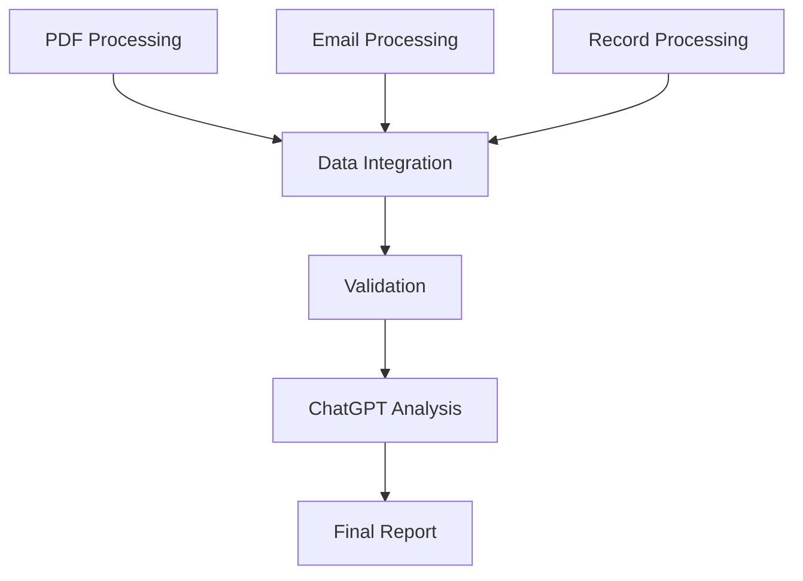

# Evidence Pipeline Analysis Flow

## Core Pipeline Flow

1. PDF Processing
   ```
   PDF → Text Extraction → Structure Detection → Content Parsing
   ```

2. Data Integration
   ```
   Emails + OFW Messages + Records → Unified Timeline → Relationships
   ```

3. Validation
   ```
   Content → Timeline → Attribution → Confidence Scoring
   ```

4. LLM Analysis (Final Step)
   ```
   Processed Data → ChatGPT Analysis → Structured Findings
   ```

## Analysis Integration

The ChatGPT analysis is the FINAL STEP in the pipeline:



## File Flow

1. Pipeline Output Files:
   - processed/timeline.json (from pipeline)
   - processed/relationships.json (from pipeline)
   - processed/validation.json (from pipeline)

2. ChatGPT Input Files:
   - processed/chatgpt-input/1-timeline.json
   - processed/chatgpt-input/2-relationships.json
   - processed/chatgpt-input/3-validation.json

3. Analysis Output Files:
   - processed/analysis/evidence-report.md
   - processed/analysis/findings.json
   - processed/analysis/review-notes.md

## Process Integration

### 1. Pipeline Processing
```javascript
// In pipeline-server.js
async function runPipeline() {
    await processPDF();
    await processEmails();
    await processRecords();
    await validateResults();
    await runChatGPTAnalysis(); // Final step
}
```

### 2. Analysis Trigger
```javascript
// In universal-processor.js
async function runChatGPTAnalysis() {
    // Prepare files for ChatGPT
    await prepareAnalysisFiles();
    
    // Generate analysis instructions
    await generateInstructions();
    
    // Notify ready for analysis
    return {
        status: 'ready',
        location: 'processed/chatgpt-input/README.md',
        nextStep: 'Upload files to ChatGPT in specified order'
    };
}
```

### 3. Results Integration
```javascript
// In evidence-chain-builder.js
async function buildFinalReport() {
    const chatGPTAnalysis = await loadAnalysis('processed/analysis/evidence-report.md');
    const structuredFindings = await loadFindings('processed/analysis/findings.json');
    
    return generateFinalReport({
        pipelineResults: pipelineOutput,
        analysis: chatGPTAnalysis,
        findings: structuredFindings
    });
}
```

## Usage in Pipeline

1. Run the full pipeline:
   ```bash
   node scripts/run-pipeline.js
   ```

2. Pipeline automatically:
   - Processes all evidence
   - Prepares files for ChatGPT
   - Creates analysis templates

3. When pipeline completes:
   - Opens README.md with instructions
   - Lists files to upload to ChatGPT
   - Provides templates for saving analysis

4. After ChatGPT analysis:
   - Save analysis in processed/analysis/
   - Run final report generation
   - Get complete evidence package

## File Locations

```
evidenceai/
├── processed/
│   ├── pipeline/           # Pipeline outputs
│   ├── chatgpt-input/     # Files for ChatGPT
│   └── analysis/          # ChatGPT analysis
└── scripts/
    ├── run-pipeline.js    # Main pipeline
    └── generate-report.js # Final report
```

## README Location

The instructions README is automatically generated at:
```
processed/chatgpt-input/README.md
```

This file is created by the pipeline and contains:
- Files to upload
- Analysis instructions
- Output templates
- Quality checklist
