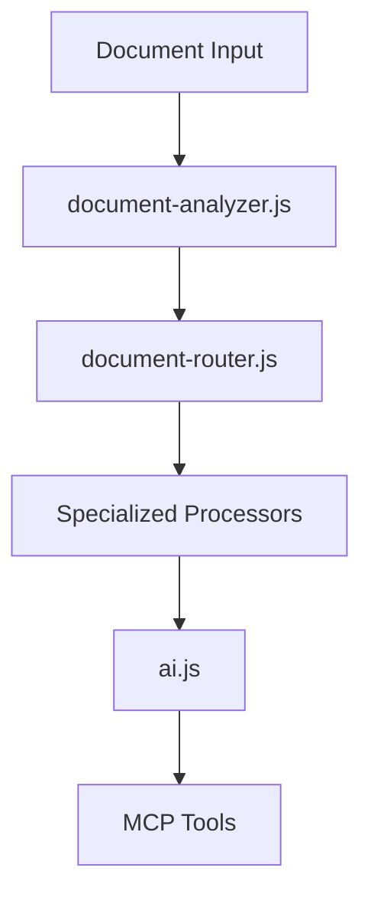

# Document Chunking Architecture

## Overview
This document outlines the mandatory chunking architecture for handling large documents in the EvidenceAI system. All services that process text through LLMs MUST follow these patterns.

## Core Principles

1. All LLM operations MUST use the unified AI service (ai.js)
   - Never make direct MCP tool calls for text processing
   - Always use analyzeText, summarizeText, or generateText from ai.js

2. Token and File Size Limits

   a. Per-Chunk Limits:
   - Maximum input size: 150,000 tokens (≈0.6MB of text)
   - Reserved for output: 50,000 tokens
   - Total limit: 200,000 tokens

   b. File Size Guidelines:
   - Single chunk: Up to 0.6MB (≈150k tokens)
   - Small files: 0.6-2.4MB (1-4 chunks)
   - Medium files: 2.4-9.6MB (4-16 chunks)
   - Large files: 9.6-30MB (16-50 chunks)
   - Maximum size: 30MB (≈7.5M tokens)
   
   c. Size to Token Conversion:
   - Average ratio: 4 characters ≈ 1 token
   - 1MB of text ≈ 250,000 tokens
   - Formula: tokens = file_size_bytes / 4

   d. Performance Considerations:
   - Optimal chunk size: 0.4-0.6MB
   - Processing time scales linearly with chunks
   - Memory usage: ~2x chunk size per process

3. Chunking Strategy

   a. Document Structure:
   - Preserve semantic boundaries (paragraphs, sections)
   - Split on natural breaks (sentences, entries)
   - Maintain section hierarchy

   b. Context Preservation:
   - Overlap between chunks: 10% (configurable)
   - Context window: 1000 tokens
   - Reference tracking across chunks

   c. Result Merging:
   - Entity deduplication
   - Cross-reference resolution
   - Timeline reconstruction
   - Confidence scoring

   d. Error Handling:
   - Graceful degradation on large files
   - Partial results preservation
   - Memory management
   - Timeout handling

## Implementation Requirements

### 1. Service Architecture



### 2. Mandatory Chunking Points
- email-processing.js: Email analysis
- ofw-processing.js: OFW-specific analysis
- outlier-analysis.js: Pattern analysis
- document-processing.js: General documents

### 3. Metadata Requirements
All services MUST include:
```typescript
interface ChunkingMetadata {
    enabled: boolean;
    chunk_count: number;
    total_tokens: number;
    avg_chunk_size: number;
}
```

## Testing Requirements

1. Token Limit Tests
   - Test with documents exceeding limits
   - Verify chunking behavior
   - Check result merging

2. Integration Tests
   - Test full processing pipeline
   - Verify metadata preservation
   - Check chunking stats

3. Monitoring Tests
   - Verify chunk size reporting
   - Check token usage tracking
   - Test alert thresholds

## Monitoring Requirements

1. Real-time Metrics
   - Document sizes
   - Chunk counts
   - Token usage
   - Processing times

2. Alerts
   - Large document detection
   - Token limit approaches
   - Chunking failures

3. Dashboards
   - Token usage trends
   - Chunk size distributions
   - Processing efficiency

## Code Review Requirements

1. Chunking Checklist
   - [ ] Uses ai.js for LLM operations
   - [ ] Includes chunking metadata
   - [ ] Implements proper error handling
   - [ ] Includes required tests

2. Performance Considerations
   - [ ] Efficient chunk size calculation
   - [ ] Smart paragraph splitting
   - [ ] Proper context preservation

## Enforcement

1. CI/CD Pipeline
   - Automated tests must pass
   - Token limit tests required
   - Chunking metadata validation

2. Code Review Process
   - Architecture review for new services
   - Chunking checklist verification
   - Performance impact assessment

3. Monitoring and Alerts
   - Real-time token usage monitoring
   - Alert on chunking bypass attempts
   - Regular efficiency reports

## Best Practices

1. Document Structure
   - Preserve semantic boundaries
   - Maintain context between chunks
   - Smart result merging

2. Error Handling
   - Graceful degradation
   - Clear error messages
   - Retry strategies

3. Performance
   - Parallel processing where possible
   - Efficient memory usage
   - Caching considerations

## Migration Guide

When adding new services:

1. Use the AI Service
```javascript
import { analyzeText } from './ai.js';

// DO NOT use MCP tools directly
const result = await analyzeText(content, {
    type: 'your_analysis_type',
    ...options
});
```

2. Include Chunking Metadata
```javascript
return {
    ...result,
    metadata: {
        chunking: {
            enabled: true,
            chunk_count: chunks.length,
            total_tokens: estimateTokenCount(content),
            avg_chunk_size: estimateTokenCount(content) / chunks.length
        }
    }
};
```

3. Add Required Tests
```javascript
describe('chunking behavior', () => {
    it('handles large documents correctly', async () => {
        const largeDoc = generateLargeDocument();
        const result = await processDocument(largeDoc);
        expect(result.metadata.chunking.enabled).toBe(true);
        expect(result.metadata.chunking.chunk_count).toBeGreaterThan(1);
    });
});
```

## Maintenance

1. Regular Reviews
   - Monthly architecture reviews
   - Performance analysis
   - Token usage audits

2. Updates
   - Document changes to chunking strategy
   - Update tests accordingly
   - Maintain backwards compatibility

3. Monitoring
   - Review alert thresholds
   - Adjust chunk sizes if needed
   - Optimize based on metrics
