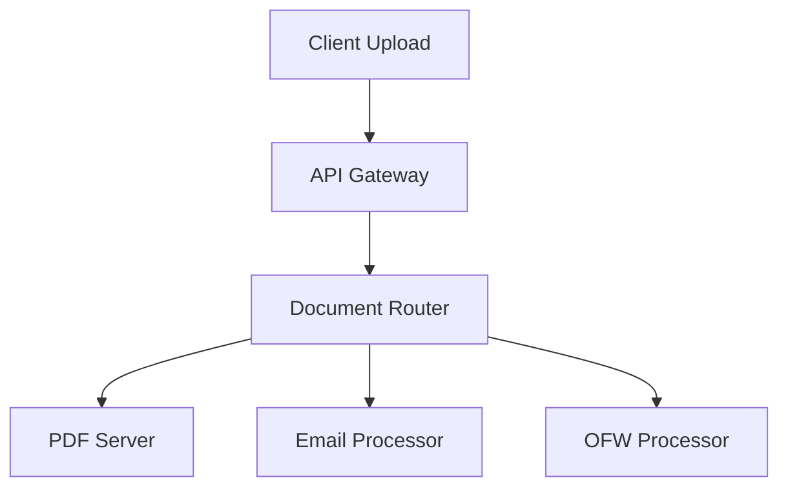
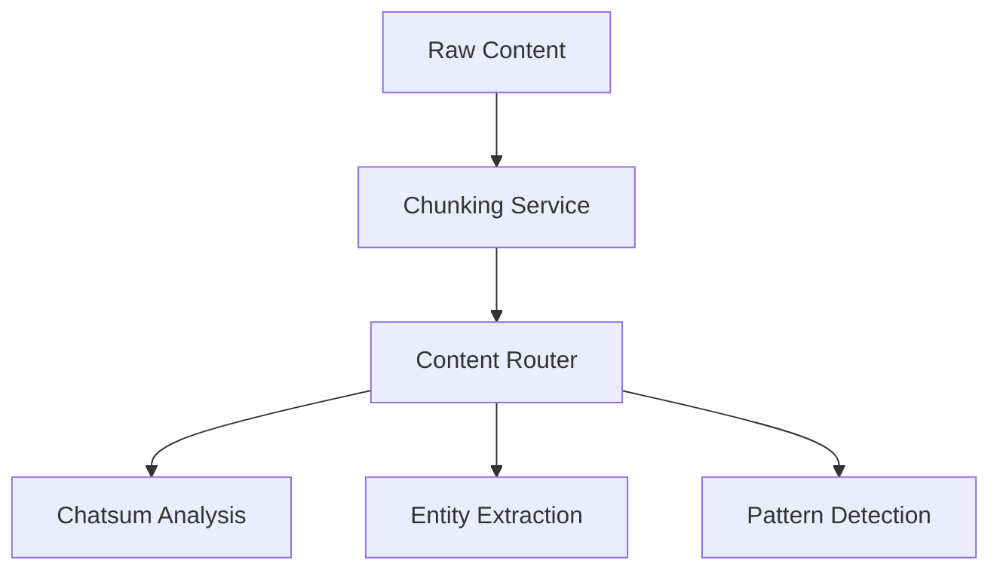
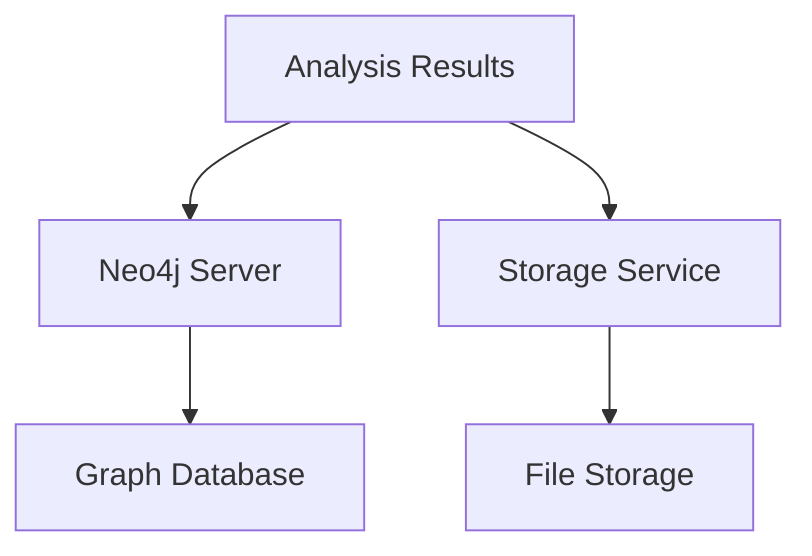
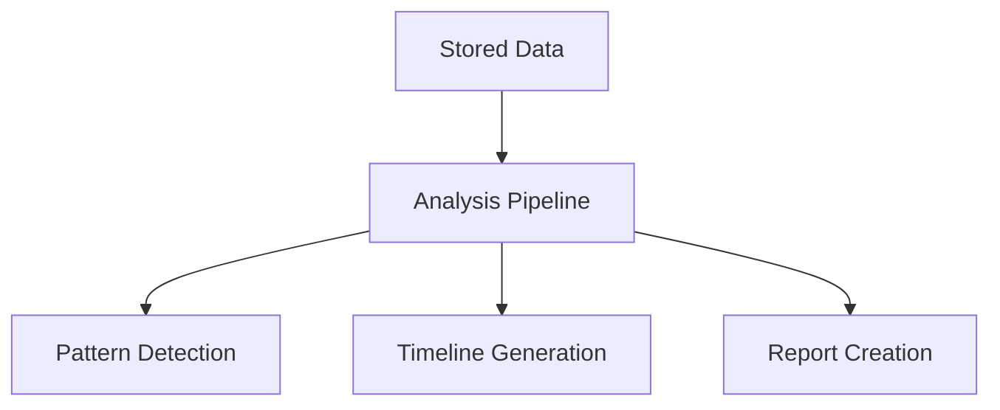

# EvidenceAI Data Pipeline

## Overview

This document describes the complete data pipeline for EvidenceAI, detailing how data flows through the system from ingestion to analysis and storage.

## Pipeline Stages

### 1. Document Ingestion


#### Components:
- PDF Server (MCP)
  * Text extraction
  * Metadata parsing
  * Page count tracking
  * Format validation

- Email Processor
  * Email parsing
  * Thread reconstruction
  * Metadata extraction

- OFW Processor
  * OFW-specific parsing
  * Communication analysis
  * Event extraction

### 2. Content Processing


#### Components:
- Chunking Service
  * Document splitting
  * Context preservation
  * Token management
  * Size optimization

- Chatsum Server (GPT-4)
  * Key point extraction
  * Pattern recognition
  * Sentiment analysis
  * Summary generation

- Deepseek Server
  * Entity extraction
  * Relationship mapping
  * Cross-reference resolution
  * Confidence scoring

### 3. Data Organization


#### Components:
- Neo4j Server
  * Entity storage
  * Relationship graphs
  * Pattern analysis
  * Query interface

- Storage Service
  * File management
  * Metadata storage
  * Version control
  * Access control

### 4. Analysis & Enrichment


#### Components:
- Pattern Detection
  * Communication patterns
  * Behavioral analysis
  * Temporal patterns
  * Relationship patterns

- Timeline Generation
  * Event ordering
  * Causality analysis
  * Context linking
  * Visualization

## Data Flow Details

### 1. Document Processing Flow
```javascript
const processingFlow = {
    stages: {
        ingestion: {
            input: 'Raw document',
            operations: ['Validation', 'Format detection', 'Initial parsing'],
            output: 'Processed content'
        },
        chunking: {
            input: 'Processed content',
            operations: ['Size analysis', 'Context preservation', 'Token counting'],
            output: 'Content chunks'
        },
        analysis: {
            input: 'Content chunks',
            operations: ['LLM analysis', 'Entity extraction', 'Pattern detection'],
            output: 'Analysis results'
        },
        storage: {
            input: 'Analysis results',
            operations: ['Data organization', 'Relationship mapping', 'Indexing'],
            output: 'Structured data'
        }
    }
};
```

### 2. Analysis Pipeline Flow
```javascript
const analysisPipeline = {
    stages: {
        preprocessing: {
            operations: ['Format normalization', 'Content cleaning', 'Metadata extraction'],
            tools: ['PDF Server', 'Email Processor', 'OFW Processor']
        },
        analysis: {
            operations: ['Content analysis', 'Entity extraction', 'Pattern detection'],
            tools: ['Chatsum Server', 'Deepseek Server']
        },
        enrichment: {
            operations: ['Relationship mapping', 'Timeline generation', 'Context linking'],
            tools: ['Neo4j Server']
        },
        output: {
            operations: ['Report generation', 'Visualization', 'Export'],
            tools: ['Report Generator', 'Timeline Generator']
        }
    }
};
```

## Integration Points

### 1. MCP Server Integration
```javascript
const mcpIntegration = {
    servers: {
        pdf: {
            tools: ['extract_text', 'get_metadata', 'get_page_count'],
            purpose: 'Document processing'
        },
        chatsum: {
            tools: ['analyze', 'summarize'],
            purpose: 'Content analysis'
        },
        deepseek: {
            tools: ['extract_entities'],
            purpose: 'Entity extraction'
        },
        neo4j: {
            tools: ['store_entities', 'query_relationships'],
            purpose: 'Data organization'
        }
    }
};
```

### 2. LLM Integration
```javascript
const llmIntegration = {
    models: {
        gpt4: {
            purpose: 'Primary analysis',
            tasks: ['Content understanding', 'Pattern detection', 'Summary generation']
        },
        deepseek: {
            purpose: 'Entity analysis',
            tasks: ['Entity extraction', 'Relationship mapping', 'Cross-referencing']
        }
    }
};
```

## Performance Considerations

### 1. Chunking Strategy
- Maximum chunk size: 150,000 tokens
- Context overlap: 10%
- Batch processing enabled
- Parallel processing where possible

### 2. Caching Strategy
```javascript
const cachingStrategy = {
    levels: {
        memory: {
            purpose: 'Quick access to recent data',
            ttl: '1 hour'
        },
        redis: {
            purpose: 'Shared cache for analysis results',
            ttl: '24 hours'
        },
        disk: {
            purpose: 'Long-term storage of processed results',
            ttl: '30 days'
        }
    }
};
```

### 3. Queue Management
```javascript
const queueManagement = {
    queues: {
        ingestion: {
            priority: 'high',
            concurrency: 5
        },
        analysis: {
            priority: 'medium',
            concurrency: 3
        },
        export: {
            priority: 'low',
            concurrency: 2
        }
    }
};
```

## Error Handling

### 1. Retry Strategy
```javascript
const retryStrategy = {
    maxAttempts: 3,
    backoff: {
        type: 'exponential',
        factor: 2
    },
    conditions: {
        shouldRetry: (error) => isTransientError(error),
        beforeRetry: (attempt) => logRetryAttempt(attempt)
    }
};
```

### 2. Fallback Processing
```javascript
const fallbackProcessing = {
    scenarios: {
        llmFailure: {
            action: 'Use backup model or simplified analysis'
        },
        storageFailure: {
            action: 'Use local storage temporarily'
        },
        analysisTimeout: {
            action: 'Process in smaller chunks'
        }
    }
};
```

## Monitoring & Metrics

### 1. Performance Metrics
```javascript
const performanceMetrics = {
    ingestion: ['throughput', 'latency', 'error_rate'],
    processing: ['chunk_size', 'processing_time', 'queue_length'],
    analysis: ['llm_latency', 'token_usage', 'cache_hits'],
    storage: ['write_latency', 'read_latency', 'storage_usage']
};
```

### 2. Quality Metrics
```javascript
const qualityMetrics = {
    analysis: ['accuracy', 'confidence', 'coverage'],
    entities: ['extraction_accuracy', 'relationship_accuracy'],
    patterns: ['detection_rate', 'false_positive_rate']
};
```

## Deployment Configuration

### 1. Resource Requirements
```javascript
const resourceRequirements = {
    compute: {
        min_cpu: '4 cores',
        min_memory: '8GB',
        recommended_memory: '16GB'
    },
    storage: {
        min_space: '100GB',
        recommended_space: '500GB'
    },
    network: {
        bandwidth: '100Mbps',
        latency: '<100ms'
    }
};
```

### 2. Scaling Configuration
```javascript
const scalingConfig = {
    auto_scaling: {
        min_instances: 2,
        max_instances: 10,
        scale_up_threshold: '75% CPU',
        scale_down_threshold: '25% CPU'
    },
    load_balancing: {
        algorithm: 'round-robin',
        health_check: '/health',
        check_interval: '30s'
    }
};
```

## Future Enhancements

### 1. Planned Improvements
- Real-time processing capabilities
- Enhanced pattern recognition
- Advanced visualization tools
- Automated quality improvement

### 2. Integration Roadmap
- Additional LLM models
- Specialized analysis tools
- Advanced caching strategies
- Global distribution support
