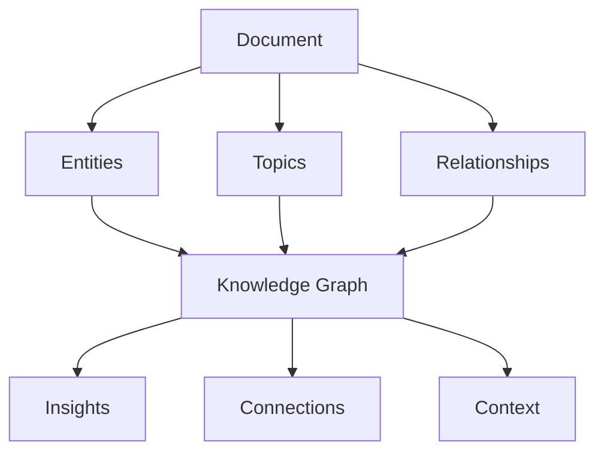

# TagSpace Lens: A Vision for Document Understanding

## The Big Picture

TagSpace Lens represents a revolutionary approach to document processing - not just extracting text, but understanding relationships, contexts, and knowledge flows. While this is a future vision, documenting it helps guide our architecture without distracting from our MVP.

## Core Concepts

### 1. Document as Knowledge Graph


### 2. Relationship Discovery
- Entity connections across documents
- Topic relationships
- Temporal sequences
- Causal links

### 3. Context Preservation
- Document hierarchy
- Discussion threads
- Reference chains
- Decision flows

## Why This Matters

### 1. Knowledge Enhancement
- Transform documents from text to knowledge
- Discover hidden connections
- Surface relevant context
- Enable deeper understanding

### 2. User Value
- Faster information discovery
- Better decision support
- Reduced manual analysis
- Comprehensive understanding

### 3. Market Opportunity
- Unique approach to document processing
- Natural evolution of current capabilities
- Clear differentiation
- Strong IP potential

## Architectural Implications

### Current Foundation
```javascript
// Our current pipeline already supports this vision
const foundation = {
    chunking: "Smart content segmentation",
    metadata: "Rich context capture",
    relationships: "Basic connection mapping",
    structure: "Document hierarchy preservation"
};
```

### Future Capabilities
```javascript
// These would build on our foundation
const future = {
    graph: "Knowledge graph construction",
    discovery: "Relationship identification",
    context: "Deep context understanding",
    insights: "Automated analysis"
};
```

## Why Document This Now

1. Architecture Guidance
   - Informs current decisions
   - Prevents dead ends
   - Enables future growth
   - Maintains flexibility

2. MVP Protection
   - Separates vision from implementation
   - Keeps focus on core features
   - Documents without distracting
   - Preserves good ideas

3. Innovation Capture
   - Records insights
   - Preserves context
   - Enables future planning
   - Protects IP

## Relationship to Current Work

### What to Keep Doing
1. Focus on core pipeline
2. Build solid foundation
3. Document thoroughly
4. Test extensively

### What Not to Do
1. Don't implement vision features yet
2. Don't complicate MVP
3. Don't mix vision with current code
4. Don't get distracted by possibilities

## Future Integration Path

### Phase 1: Foundation (Current)
- Solid PDF processing
- Clean metadata extraction
- Basic relationship tracking
- Google Sheets integration

### Phase 2: Enhancement (Future)
- Entity extraction
- Topic modeling
- Relationship mapping
- Basic graph construction

### Phase 3: TagSpace Lens (Vision)
- Knowledge graph integration
- Advanced relationship discovery
- Context-aware processing
- Insight generation

## Guiding Principles

1. "Vision Informs, Doesn't Drive"
   - Use vision for architecture decisions
   - Don't let it dictate implementation
   - Keep MVP focused
   - Document future possibilities

2. "Foundation First"
   - Build solid core features
   - Create clean interfaces
   - Maintain flexibility
   - Enable future growth

3. "Separate Concerns"
   - Keep vision documentation separate
   - Don't mix with implementation
   - Maintain clear boundaries
   - Preserve focus

## For Mira

This vision is important to understand because:
1. It shows where we're heading
2. It explains some architectural choices
3. It captures valuable insights
4. It guides future development

But remember:
1. Focus on the MVP
2. Build on what works
3. Keep things simple
4. Document your insights

The TagSpace lens is exciting, but it's a vision to guide us, not a task list. Your mission is to make the core pipeline accessible through Mission Control while keeping this vision in mind for future evolution.
