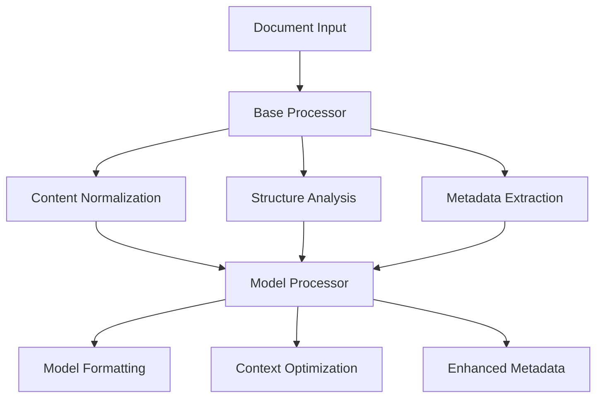

# Document Processing Architecture

## Core Processing Principles

1. Base Processing (base-processor.js)
   - Content normalization
   - Structure preservation
   - Metadata extraction
   - Reference tracking
   - Document type detection

2. Model-Specific Processing
   - Extends base processor
   - Adds model-specific formatting
   - Optimizes for model context windows
   - Enhances metadata for model needs

## Processing Flow



## Current Processors

### Deepseek (Implemented)
- Extends BaseProcessor
- Max context: 25K tokens
- Chunk size: 12K tokens
- Formatting:
  * Sections: `### Section Name ###`
  * Emails: `=== Header: Value`
  * Lists: `• List item`
  * Code: `### CODE lang ### ... ### END CODE ###`

### Claude (Planned)
- Will extend BaseProcessor
- Max context: 100K tokens
- Chunk size: 75K tokens
- Formatting:
  * XML-style tags
  * Human/Assistant framing
  * System messages

### GPT-4 (Planned)
- Will extend BaseProcessor
- Max context: 32K tokens
- Chunk size: 25K tokens
- Formatting:
  * Markdown-style
  * System messages
  * Function calling format

### NotebookLM (Planned)
- Will extend BaseProcessor
- Max context: 200K tokens
- Chunk size: 150K tokens
- Formatting:
  * Jupyter-style cells
  * Citation blocks
  * Source tracking

### Sonnet (Planned)
- Will extend BaseProcessor
- Max context: 16K tokens
- Chunk size: 12K tokens
- Formatting:
  * Minimal markers
  * Clean text focus
  * Simple delimiters
## Implementation Guide

1. Extend BaseProcessor:
```javascript
import BaseProcessor from '../base-processor.js';

class ModelProcessor extends BaseProcessor {
    constructor() {
        super();
        this.modelName = 'model_name';
        this.maxInputSize = 0;
        this.preferredChunkSize = 0;
        this.overlapSize = 0;
    }
}
```

2. Process with Base + Model Steps:
```javascript
async processPdf(filePath) {
    // Get PDF result
    const pdfResult = await this.pdfProcessor.processPdf(filePath);
    
    // Apply base preprocessing
    const processed = await this.preProcess(content);
    
    // Add model-specific formatting
    return {
        ...processed,
        text: this.formatForModel(processed.normalized),
        metadata: this.enhanceMetadata(processed.metadata)
    };
}
```

3. Add Model-Specific Formatting:
```javascript
formatForModel(text) {
    // Apply model's preferred formatting
    return formattedText;
}

enhanceMetadata(metadata) {
    // Add model-specific metadata
    return enhancedMetadata;
}
```

## Usage

```javascript
import modelProcessor from './models/model-processor.js';

// Process document
const result = await modelProcessor.processPdf(filePath);

// Access results
console.log(result.raw_content.chunks);        // Processed chunks
console.log(result.model_meta);                // Model settings
console.log(result.raw_content.structure);     // Document structure
```

## Testing

1. Base Processing Tests:
- Content normalization
- Structure preservation
- Metadata extraction
- Reference tracking

2. Model-Specific Tests:
- Formatting rules
- Context windows
- Token limits
- Output structure

## Monitoring

1. Track Processing:
- Chunk sizes
- Token usage
- Processing time
- Success rates

2. Quality Checks:
- Structure preservation
- Reference integrity
- Format consistency
